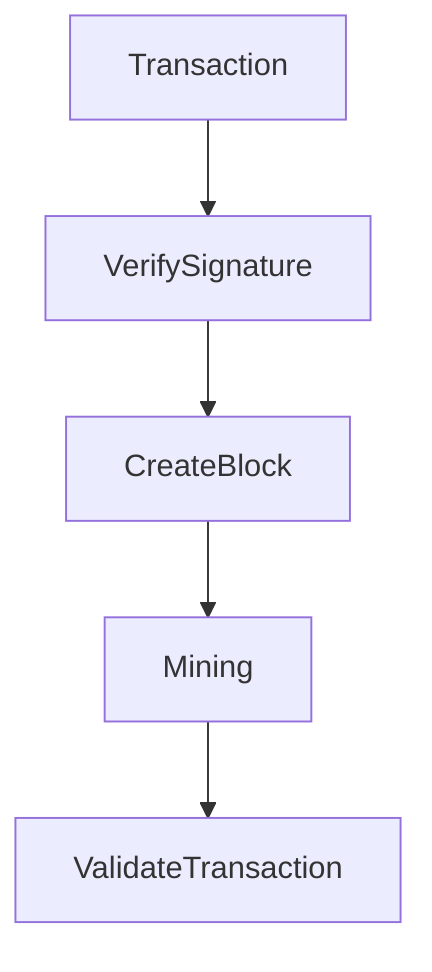

# Blockchain-Client
Небольшой блокчейн-клиент, который открывает P2P ноду и API-клиент. 

## Блокчейн
Примитивный блокчейн с базовым функционалом и консенсусом Proof-Of-Work (майнинг).

Характеристика блокчейна:
| Тип | Алгоритм шифрования | Децентрализация | Консенсус |
| ------------- | ------------- | ------------- | ------------- |
| Блочный | SHA256 | 1 тестовый узел | Proof-Of-Work (POW) |

## API-клиент
Базово открывается на порте 5000. Поддерживает GET и POST запросы. 

Характеристика Endpoint'ов: 

| Название  | Адрес | Аргументы | Функция |
| ------------- | ------------- | ------------- | ------------- |
| Connect (POST)  | api/wallet/connect  | WalletId, WalletAddress | Подключение к клиенту |
| Balance (GET)  | api/wallet/balance  | - | Получение баланса по адресу |
| Mine (POST)  | api/wallet/mine | MinerAddress | Получение баланса по адресу |
| Transaction (POST)  | api/wallet/transaction  | Sender, Recipient, Amount, Signature, PublicKey | Отправка транзакции |
| Transactions (GET)  | api/wallet/transactions  | WalletAddress | Получение истории транзакций |
